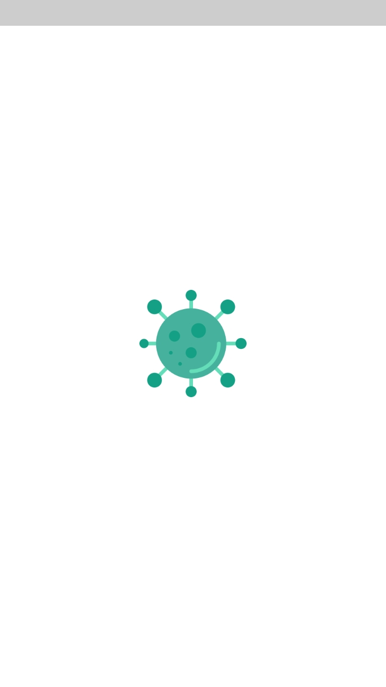
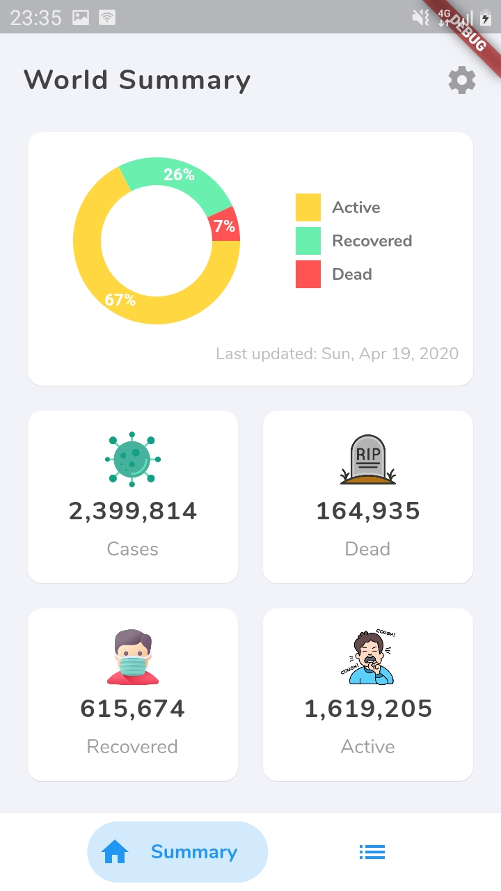
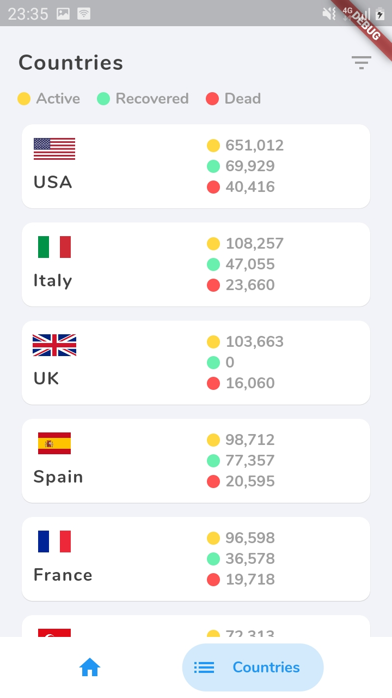
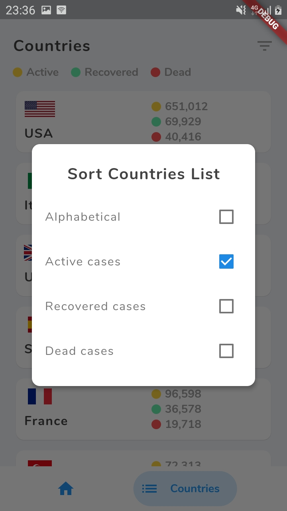
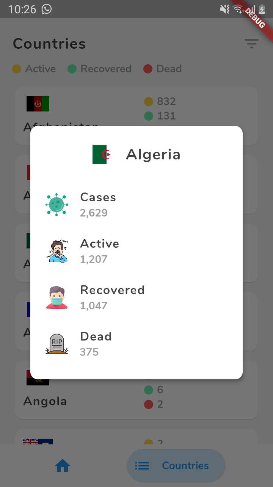

# Covid-19
[](http://www.apache.org/licenses/LICENSE-2.0)


A flutter application to track Covid-19 statistics. The data is fetched from [NovelCovid](https://github.com/NovelCOVID/API) API.
The design was inspired by [Hasan Aydın](https://dribbble.com/hasanaydins)'s design on [Dribbble](https://dribbble.com/shots/10821409-Corona-Cases-Tracker-App).
Image assets in the app are from [Flaticon](https://www.flaticon.com).

You can download the apk here: [Covid-19](https://drive.google.com/open?id=1y-iucF3mHIvI4QOKd7e0DHJEenE7GNB5) or if you are sure 
about your device architecture platform:
- [arm64](https://drive.google.com/open?id=1dxYt2K-tD24f5jZVty0v-eJo_t5p28E-)
- [armeabi](https://drive.google.com/open?id=1HmtinKFcL4fWPUjtTwDlBEQenTymFYXG)
- [x86](https://drive.google.com/open?id=1_d8a6l1Mj7BVMBBQ3T4Xcb6R8DGSGS-8)

### Features
- Flutter
- REST API
- Material Design

### Screenshots
|                 |                  |          
| --------------- | ---------------- |
|  |  | 
|  |  |
|  |

### Libraries Used
- [bottom_navy_bar](https://pub.dev/packages/bottom_navy_bar) - Bottom Navigation Bar
- [pie_chart](https://pub.dev/packages/pie_chart) - Pie Chart
- [http](https://pub.dev/packages/http) - HTTP Client
- [intl](https://pub.dev/packages/intl) - Flutter utils library (e.g. Formatting date)
- [flutter_money_formatter](https://pub.dev/packages/flutter_money_formatter) - Number formatter to add comma separator
- [loading](https://pub.dev/packages/loading) - Loading indicator
- [fluttertoast](https://pub.dev/packages/fluttertoast) - Toast notifications

### To Do
- [ ] Cache Locally
- [ ] Dark Theme
- [ ] Tests

### Getting Started with Flutter

This project is a starting point for a Flutter application.

A few resources to get you started if this is your first Flutter project:

- [Lab: Write your first Flutter app](https://flutter.dev/docs/get-started/codelab)
- [Cookbook: Useful Flutter samples](https://flutter.dev/docs/cookbook)

For help getting started with Flutter, view our
[online documentation](https://flutter.dev/docs), which offers tutorials,
samples, guidance on mobile development, and a full API reference.


### License
```
Copyright 2020 Vincent Tirgei

Licensed under the Apache License, Version 2.0 (the "License");
you may not use this file except in compliance with the License.
You may obtain a copy of the License at

    http://www.apache.org/licenses/LICENSE-2.0

Unless required by applicable law or agreed to in writing, software
distributed under the License is distributed on an "AS IS" BASIS,
WITHOUT WARRANTIES OR CONDITIONS OF ANY KIND, either express or implied.
See the License for the specific language governing permissions and
limitations under the License.
```

